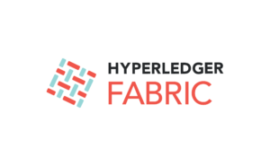
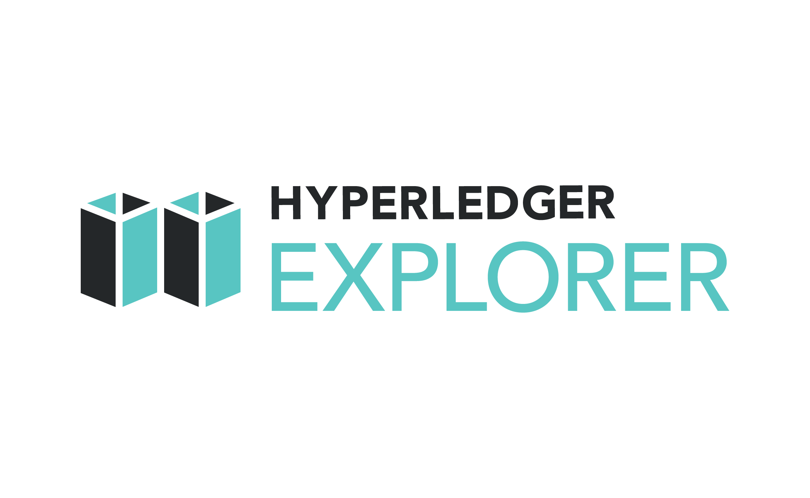
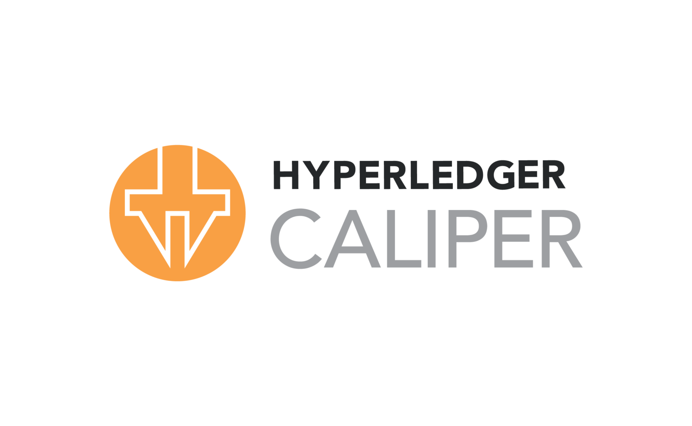
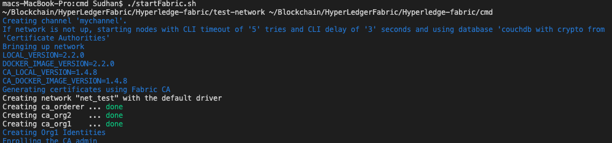
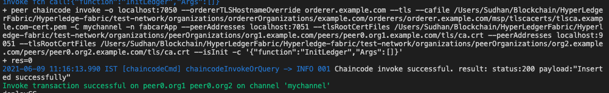
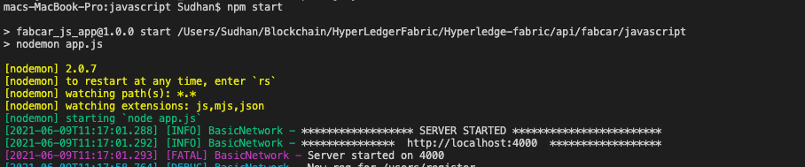
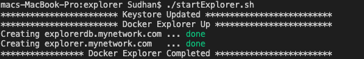
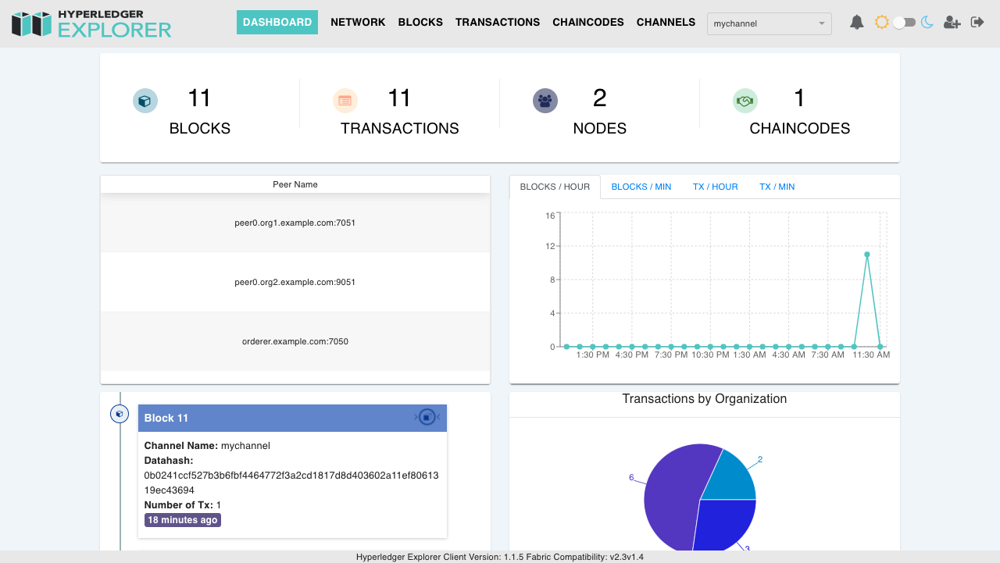
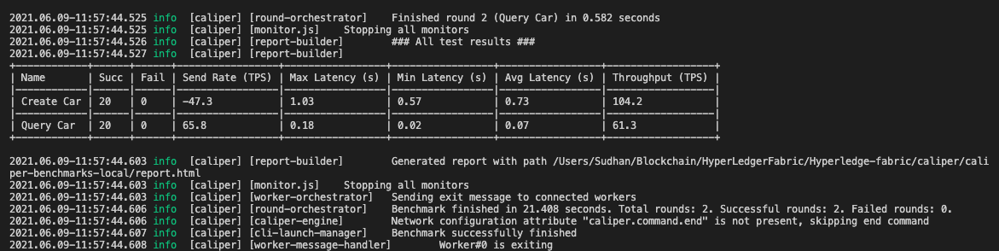
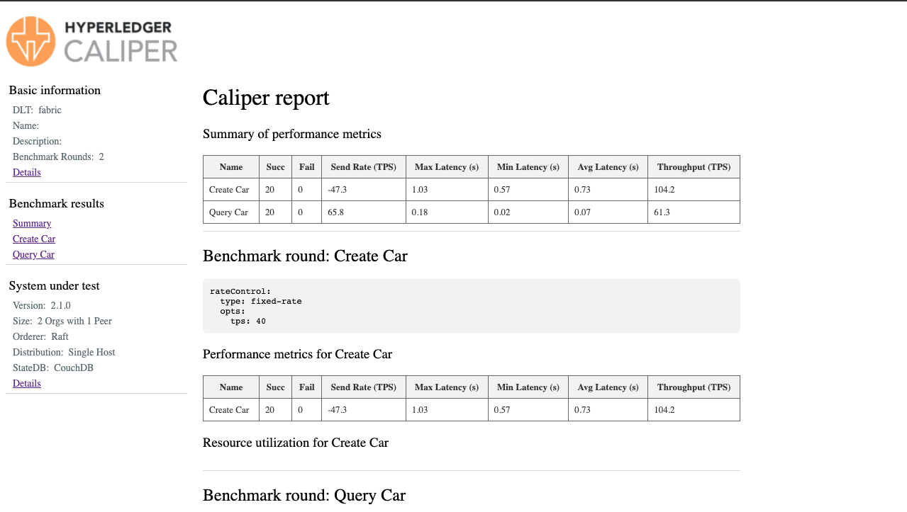

# Simple Vehicle Management System

 

## About Project

- Implemented using existing **Fabcar** samples from **Hyperledger Fabric** git repository with my own customization logic.
- Created a single **channel**, two **organizations**, a single **orderer** with each organization having a single **peer**.
- Each organization implemented with own Fabric CA standard of **X509 certificates**.
- Developed fast and efficient chaincode written in **Go** and **Javascript** to manipulate, format client data, and then store it in the ledger.
- Used the internal **CouchDB** database for world state which allows for quick data retrieval and operation.
- Utilized implicit **Private Data Collection** model which is used to see data by organization level.
- Improved performance by integrating **Hyperledger Explore** which provides necessary network information of the blockchain and also integrated **Hyperledger Caliper** benchmark tool which allows users to measure the performance of a blockchain network with predefined use cases.
- Created **Rest API** routes by using **NodeJS** server which will invoke and query data from the fabric network.
- Node js application having the functionality of enrolling **Admin** and **Registering user**, invoke and query data from chaincode by using fabric network.

---

## Tool, Framework, Language

- Hyperledger **Fabric** [ `v2.2.0` ]
- Hyperledger **Explorer** [ `latest` ]
- Hyperledger **Caliper** [ `v0.4.0` ]
- Go [ `go1.15.5` ]
- Docker [ `v19.03.4` ]
- Node [ `v12.13.1` ]
- npm [ `6.12.1` ]
- Node JS
- Shell Script
- Postman

---

## Project Structure

- **api** [ `Rest API Service used communicate with fabric network` ]
- **bin** [ `Hyperledger Fabric binaries` ]
- **caliper** [ `Caliper benchmark tool integration setup` ]
- **chaincode** [ `Application Chaincode in Go and  NodeJS  SDK` ]
- **cmd** [ `Script used to start and stop the fabric network`  ]
- **common-utils** [ `Private Data Collection JSON File` ]
- **config** [ `Channel Configuration` ]
- **explorer** [ `Explorer tool integration setup` ]
- **test-network**
  - `test network` is provided for learning about Fabric by running nodes on your local machine. Use the network to test their smart contracts and applications.

---

## Final Output Screenshot

### Start Fabric

 
  

**...**

 
  

---

### Start Node Server

 
  

**...**

 
  

---

### Start Explorer

 
  

**...**

 
  

---

### Start Caliper

 
  

**...**

 
  

---

## Contact

- **Sudhan Manoharan**
- **sudhanmanoharan@gmail.com**
